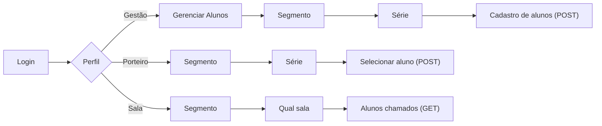

# 🔔 Saída Inteligente

**Chega de fila na portaria.** Sistema de chamada em tempo real que conecta a portaria, a gestão escolar e a sala de aula no momento da saída dos alunos.


---

## 📌 O problema

Na saída escolar, o processo de liberar cada aluno costuma depender de chamadas por interfone, deslocamento físico de funcionários ou controle manual em papel — gerando **aglomeração na portaria**, **demora** e **falta de rastreabilidade** de quem saiu e em que horário.

## 🚀 A solução

A **Saída Inteligente** é uma iniciativa de extensão universitária do curso de Sistemas de Informação, que digitaliza esse processo em tempo real, aproveitando a infraestrutura já existente na escola (TVs, projetores e outros aparatos eletrônicos):

- O porteiro registra a chamada em segundos, direto no notebook/tablet.
- O nome do aluno aparece instantaneamente na tela da sala de aula.
- A gestão mantém um cadastro completo e auditável de todos os alunos.

**Resultado:** mais segurança, mais agilidade e zero aglomeração na saída.

---

## 🎯 Objetivo

Desenvolver e implantar um sistema de chamada em tempo real para a saída dos alunos, otimizando a segurança e o fluxo do ambiente escolar, eliminando aglomerações na portaria em horários de pico e estabelecendo um controle rigoroso e auditável para a liberação de cada estudante.

---

## 🧩 Perfis de acesso

| Perfil | O que faz |
|---|---|
| 🛠️ **Gestão** | Cadastra, edita e remove alunos da base do sistema |
| 🚪 **Porteiro** | Localiza o aluno informado pelo responsável e registra a chamada |
| 🖥️ **Sala** | Exibe em tempo real, na TV/projetor, a lista de alunos chamados da turma |

## 🔄 Fluxo resumido



> 📄 Documentação completa do fluxo, telas e endpoints disponível em [`/docs`](./docs).

---

## ✨ Benefícios

**Para a instituição**
- Otimização da logística e aumento da segurança.
- Transparência na liberação dos alunos, gerando percepção de eficiência para os pais.
- Registro digital e editável do horário exato de liberação de cada estudante — sem custos extras de infraestrutura.

**Para a equipe de desenvolvimento**
- Vivência prática de todo o ciclo de vida do desenvolvimento de software.
- Desenvolvimento de habilidades interpessoais: comunicação, gestão de projetos e negociação com usuários leigos.
- Um caso real de impacto social para o portfólio profissional.

---

## 🛠️ Tecnologias

> _Preencher com a stack utilizada no projeto (ex: React, Node.js, Express, PostgreSQL, Socket.io, etc.)_

- Frontend: `_______`
- Backend: `_______`
- Banco de dados: `_______`
- Comunicação em tempo real: `_______`

---

## ⚙️ Como executar o projeto

```bash
# Clone o repositório
git clone https://github.com/seu-usuario/saida-inteligente.git

# Acesse a pasta
cd saida-inteligente

# Instale as dependências
npm install

# Rode o projeto
npm start
```

> _Ajustar os comandos acima conforme a stack final do projeto._

---

## 👥 Equipe

| Nome | Função |
|---|---|
| `_______` | `_______` |
| `_______` | `_______` |
| `_______` | `_______` |

---

## 📄 Licença

Este projeto está sob a licença MIT — veja o arquivo [LICENSE](./LICENSE) para mais detalhes.

---

<p align="center">Projeto desenvolvido como parte das Atividades Práticas Interdisciplinares de Extensão II — Sistemas de Informação</p>
